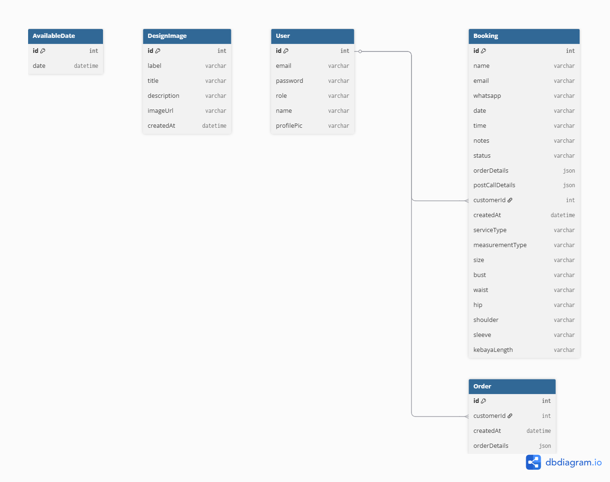

# Backend Documentation

## Overview

This backend is built with Node.js, TypeScript, and Prisma ORM, and uses a PostgreSQL database. It provides APIs for user management, bookings, orders, and design image cataloging for a service-based application.

---

## Features

- User registration, authentication, and profile management
- Admin and customer roles
- Booking management (create, update, delete, view)
- Available dates management
- Design image cataloging
- Order management

---

## Deployment

- [Backend Live Demo](https://final-project-be-putuarya28.onrender.com/)

---

## Screenshots

| API Example                                                                       | Admin Panel                                                                        |
| --------------------------------------------------------------------------------- | ---------------------------------------------------------------------------------- |
|  |  |

---

---

## Table of Contents

- [Project Structure](#project-structure)
- [Setup & Installation](#setup--installation)
- [Environment Variables](#environment-variables)
- [Scripts](#scripts)
- [Entity Relationship Diagram (ERD)](#entity-relationship-diagram-erd)
- [Entities](#entities)
- [API Endpoints](#api-endpoints)

---

## Project Structure

```
backend/
	app.js
	jest.config.js
	package.json
	tsconfig.json
	prisma/
		schema.prisma
		migrations/
	scripts/
		createAdmin.ts
		hashPassword.js
	src/
		app.module.ts
		main.ts
		auth/
		available-dates/
		bookings/
		...
	uploads/
	docs/
		ERD.md
```

---

## Setup & Installation

1. Install dependencies:
   ```sh
   pnpm install
   ```
2. Set up your `.env` file with the correct `DATABASE_URL`.
3. Run database migrations:
   ```sh
   pnpm prisma migrate deploy
   ```
4. Start the backend server:
   ```sh
   pnpm start
   ```

---

## Environment Variables

- `DATABASE_URL`: Connection string for your PostgreSQL database.

---

## Scripts

- `createAdmin.ts`: Script to create an admin user.
- `hashPassword.js`: Utility to hash passwords.

---

## Entity Relationship Diagram (ERD)

Below is the Entity Relationship Diagram (ERD) for the backend database schema:



---

## Entities

- **User**: Application users (customers, admins, etc.)
- **Booking**: Bookings made by users
- **AvailableDate**: Dates available for booking
- **DesignImage**: Images of available designs
- **Order**: Orders placed by users

---

## API Endpoints

> Note: Actual endpoints may vary. See your `src/` folder for implementation details.

### User

- `POST /auth/register` — Register a new user
- `POST /auth/login` — User login
- `GET /users/:id` — Get user profile

### Booking

- `POST /bookings` — Create a new booking
- `GET /bookings` — List all bookings
- `GET /bookings/:id` — Get booking details
- `PATCH /bookings/:id` — Update booking
- `DELETE /bookings/:id` — Delete booking

### Available Dates

- `GET /available-dates` — List available dates
- `POST /available-dates` — Add a new available date

### Design Images

- `GET /design-images` — List all design images
- `POST /design-images` — Add a new design image

### Orders

- `POST /orders` — Create a new order
- `GET /orders` — List all orders
- `GET /orders/:id` — Get order details

---

For more details, see the code in the `src/` directory.
